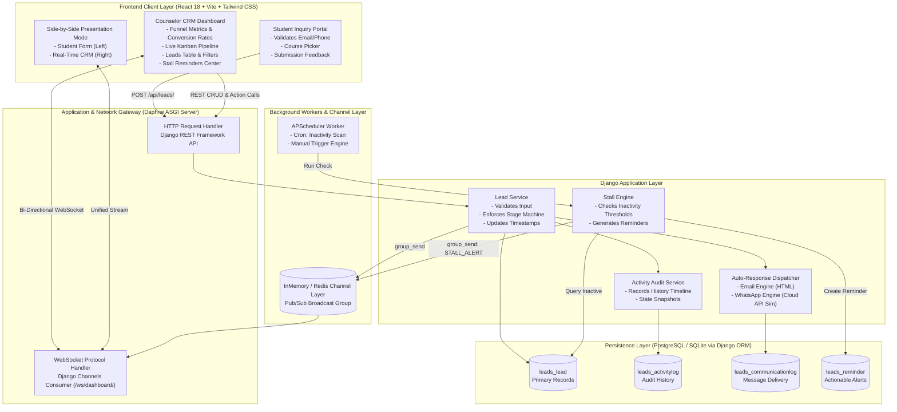
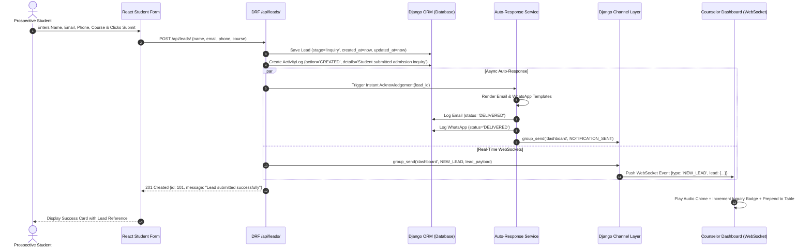
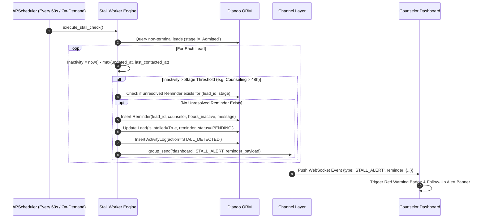
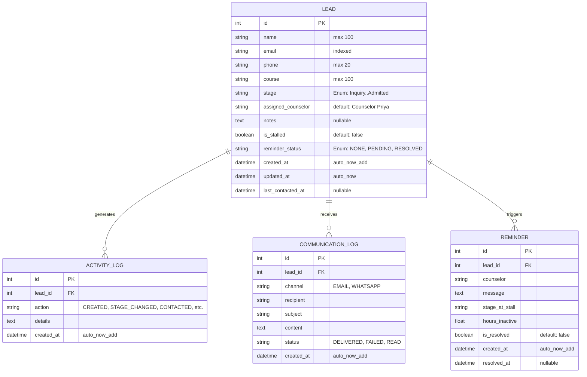

# Student Admission Lead Automation System – Comprehensive System Design & Implementation Plan

This document provides the complete, low-level technical architecture, system design, database schemas, REST API contracts, WebSocket protocols, background automation workflows, and UI component hierarchy for the **Student Admission Lead Automation System**, built with **Django REST Framework (DRF)**, **Django Channels (ASGI/Daphne)**, and **React (Vite)**.

---

## Table of Contents
1. [Executive Summary & Core Works](#1-executive-summary--core-works)
2. [End-to-End System Flow & Architecture Diagrams](#2-end-to-end-system-flow--architecture-diagrams)
3. [Low-Level Sequence Diagrams](#3-low-level-sequence-diagrams)
4. [Complete Database Schema & Data Models](#4-complete-database-schema--data-models)
5. [REST API Specifications & Payload Contracts](#5-rest-api-specifications--payload-contracts)
6. [WebSocket Real-Time Broadcast Protocol](#6-websocket-real-time-broadcast-protocol)
7. [Automation & Background Worker Algorithms](#7-automation--background-worker-algorithms)
8. [Instant Auto-Response Engine (Email & WhatsApp)](#8-instant-auto-response-engine-email--whatsapp)
9. [Frontend Architecture & Component Hierarchy](#9-frontend-architecture--component-hierarchy)
10. [Presentation & Demo Suite (Section 13 Compliance)](#10-presentation--demo-suite-section-13-compliance)
11. [Project File Structure](#11-project-file-structure)
12. [Verification & Testing Plan](#12-verification--testing-plan)

---

## 1. Executive Summary & Core Works

The platform automates the student inquiry-to-enrollment lifecycle across four distinct pillars:

| Pillar | Focus | Technology Used | Output Deliverable |
|---|---|---|---|
| **Work 1: Real-Time Form to Dashboard** | Zero-latency lead ingestion | React Form → DRF `POST /api/leads/` → SQLite/PostgreSQL → Django Channels (Daphne ASGI) | Lead displays on counselor dashboard instantly without page reload. |
| **Work 2: Instant Auto-Response** | Immediate multi-channel student acknowledgement | Post-save signal/service → Modular Email & WhatsApp dispatcher → `CommunicationLog` | Student receives personalized acknowledgement within 3 seconds; counselors inspect delivery status. |
| **Work 3: Admission Stage Tracking & Funnel CRM** | Lifecycle pipeline & conversion visibility | Django ORM → Stage Transition Engine → `ActivityLog` → Interactive Funnel & Kanban UI | Full visibility across 6 stages: *Inquiry → Counseling → Document Collection → Application → Fee/Verification → Admitted*. |
| **Work 4: Stall Reminder Automation** | Inactivity monitoring & follow-up enforcement | APScheduler background worker → Inactivity threshold evaluator → `Reminder` generator → WebSocket alert | Flags inactive leads (e.g., >48h in Counseling), alerts counselor via audio/visual banner, prevents drop-offs. |

---

## 2. End-to-End System Flow & Architecture Diagrams



---

## 3. Low-Level Sequence Diagrams

### 3.1 Sequence 1: Student Form Submission → Real-Time CRM Broadcast & Auto-Response



### 3.2 Sequence 2: Scheduled Stall Detection & Reminder Generation



---

## 4. Complete Database Schema & Data Models

All models are managed via Django ORM in `leads/models.py`.



### Detailed Field Specifications
1. **`Lead` Model**:
   - `id`: AutoField (Primary Key).
   - `name`: `CharField(max_length=100)` – Full student name.
   - `email`: `EmailField(db_index=True)` – Prospective student email.
   - `phone`: `CharField(max_length=20)` – Contact number.
   - `course`: `CharField(max_length=100)` – Selected curriculum (e.g., *B.Tech CSE, MBA, Data Science, AI & Robotics, BBA*).
   - `stage`: `CharField(max_length=30, choices=STAGES, default='Inquiry', db_index=True)`.
   - `assigned_counselor`: `CharField(max_length=100, default='Counselor Priya')`.
   - `notes`: `TextField(blank=True, null=True)`.
   - `is_stalled`: `BooleanField(default=False, db_index=True)`.
   - `reminder_status`: `CharField(max_length=20, default='NONE')`.
   - `created_at`: `DateTimeField(auto_now_add=True)`.
   - `updated_at`: `DateTimeField(auto_now=True)`.
   - `last_contacted_at`: `DateTimeField(null=True, blank=True)`.
2. **`ActivityLog` Model**:
   - `lead`: `ForeignKey(Lead, on_delete=models.CASCADE, related_name='activity_logs')`.
   - `action`: `CharField(max_length=50)`.
   - `details`: `TextField()`.
   - `created_at`: `DateTimeField(auto_now_add=True)`.
3. **`CommunicationLog` Model**:
   - `lead`: `ForeignKey(Lead, on_delete=models.CASCADE, related_name='communication_logs')`.
   - `channel`: `CharField(max_length=20, choices=['EMAIL', 'WHATSAPP'])`.
   - `recipient`: `CharField(max_length=120)`.
   - `subject`: `CharField(max_length=200, blank=True)`.
   - `content`: `TextField()`.
   - `status`: `CharField(max_length=20, default='DELIVERED')`.
   - `created_at`: `DateTimeField(auto_now_add=True)`.
4. **`Reminder` Model**:
   - `lead`: `ForeignKey(Lead, on_delete=models.CASCADE, related_name='reminders')`.
   - `counselor`: `CharField(max_length=100)`.
   - `message`: `TextField()`.
   - `stage_at_stall`: `CharField(max_length=50)`.
   - `hours_inactive`: `FloatField(default=0.0)`.
   - `is_resolved`: `BooleanField(default=False, db_index=True)`.
   - `created_at`: `DateTimeField(auto_now_add=True)`.
   - `resolved_at`: `DateTimeField(null=True, blank=True)`.

---

## 5. REST API Specifications & Payload Contracts

All endpoints return standard JSON responses with HTTP status codes.

### 5.1 `POST /api/leads/` – Submit Admission Inquiry (Work 1 & 2)
- **Request Body**:
  ```json
  {
    "name": "Rahul Sharma",
    "email": "rahul@example.com",
    "phone": "+91 9876543210",
    "course": "B.Tech CSE",
    "notes": "Interested in AI specialization and campus hostel facilities."
  }
  ```
- **Response (201 Created)**:
  ```json
  {
    "id": 101,
    "name": "Rahul Sharma",
    "email": "rahul@example.com",
    "phone": "+91 9876543210",
    "course": "B.Tech CSE",
    "stage": "Inquiry",
    "assigned_counselor": "Counselor Priya",
    "is_stalled": false,
    "reminder_status": "NONE",
    "created_at": "2026-09-10T12:00:00Z",
    "updated_at": "2026-09-10T12:00:00Z",
    "auto_response_sent": true
  }
  ```

### 5.2 `GET /api/leads/` – List & Filter Leads (Work 3)
- **Query Parameters**:
  - `stage`: Filter by stage (`Inquiry`, `Counseling`, etc.).
  - `course`: Filter by course name.
  - `is_stalled`: Filter by boolean (`true` / `false`).
  - `search`: Full text search on name, email, phone.
- **Response (200 OK)**:
  ```json
  {
    "count": 1,
    "results": [
      {
        "id": 101,
        "name": "Rahul Sharma",
        "email": "rahul@example.com",
        "phone": "+91 9876543210",
        "course": "B.Tech CSE",
        "stage": "Inquiry",
        "assigned_counselor": "Counselor Priya",
        "is_stalled": false,
        "reminder_status": "NONE",
        "created_at": "2026-09-10T12:00:00Z",
        "updated_at": "2026-09-10T12:00:00Z",
        "last_contacted_at": null
      }
    ]
  }
  ```

### 5.3 `PATCH /api/leads/<id>/` – Update Stage or Notes (Work 3)
- **Request Body**:
  ```json
  {
    "stage": "Counseling",
    "notes": "Telephonic counseling completed. Student requested fee structure."
  }
  ```
- **Side Effects**:
  - Updates `stage` and `updated_at`.
  - Appends to `ActivityLog` ("Stage updated from Inquiry to Counseling").
  - Broadcasts `LEAD_UPDATED` event to all WebSocket clients.
- **Response (200 OK)**: Updated lead object.

### 5.4 `POST /api/leads/<id>/contact/` – Record Counselor Contact (Work 3 & 4)
- **Request Body**:
  ```json
  {
    "channel": "PHONE_CALL",
    "notes": "Discussed scholarship eligibility and document submission deadline."
  }
  ```
- **Side Effects**:
  - Updates `last_contacted_at = now()`, `is_stalled = False`, `reminder_status = 'RESOLVED'`.
  - Resolves any open `Reminder` records for this lead.
  - Adds `ActivityLog` entry.
  - Broadcasts `LEAD_UPDATED` event.

### 5.5 `GET /api/dashboard/` – Funnel Analytics & Pipeline Health (Work 3)
- **Response (200 OK)**:
  ```json
  {
    "total_leads": 45,
    "stalled_leads_count": 3,
    "conversion_rate": 17.8,
    "stages": [
      {"stage": "Inquiry", "count": 15, "percentage": 33.3},
      {"stage": "Counseling", "count": 12, "percentage": 26.7},
      {"stage": "Document Collection", "count": 8, "percentage": 17.8},
      {"stage": "Application", "count": 5, "percentage": 11.1},
      {"stage": "Fee/Verification", "count": 2, "percentage": 4.4},
      {"stage": "Admitted", "count": 3, "percentage": 6.7}
    ],
    "recent_activities": [
      {
        "id": 89,
        "lead_name": "Rahul Sharma",
        "action": "STAGE_CHANGED",
        "details": "Moved to Counseling",
        "created_at": "2026-09-10T12:05:00Z"
      }
    ]
  }
  ```

### 5.6 `GET /api/reminders/` & `POST /api/reminders/<id>/dismiss/` (Work 4)
- `GET /api/reminders/`: Returns active unresolved reminders with student details and inactivity hours.
- `POST /api/reminders/<id>/dismiss/`: Sets `is_resolved = True`, records `resolved_at = now()`.

### 5.7 Demo Control Endpoints (Section 13)
- `POST /api/demo/seed/`: Seeds 12 realistic admission inquiries distributed across all 6 stages.
- `POST /api/demo/simulate-stall/`:
  - Body: `{"lead_id": 101, "days_ago": 3}`
  - Rewinds `updated_at` and `last_contacted_at` by 3 days.
- `POST /api/demo/run-stall-check/`: Immediately invokes the background stall detection logic.

---

## 6. WebSocket Real-Time Broadcast Protocol

- **Endpoint**: `ws://localhost:8000/ws/dashboard/`
- **ASGI Consumer**: `leads/consumers.py::DashboardConsumer`
- **Group Name**: `"admission_dashboard"`

### Payload Schemas

#### Event 1: `NEW_LEAD`
```json
{
  "type": "NEW_LEAD",
  "data": {
    "id": 102,
    "name": "Ananya Patel",
    "email": "ananya@example.com",
    "phone": "+91 9811223344",
    "course": "MBA",
    "stage": "Inquiry",
    "assigned_counselor": "Counselor Priya",
    "created_at": "2026-09-10T12:10:00Z"
  }
}
```

#### Event 2: `STAGE_UPDATED` / `LEAD_UPDATED`
```json
{
  "type": "LEAD_UPDATED",
  "data": {
    "id": 101,
    "name": "Rahul Sharma",
    "previous_stage": "Inquiry",
    "stage": "Counseling",
    "updated_at": "2026-09-10T12:12:00Z"
  }
}
```

#### Event 3: `STALL_ALERT`
```json
{
  "type": "STALL_ALERT",
  "data": {
    "reminder_id": 15,
    "lead_id": 101,
    "lead_name": "Rahul Sharma",
    "course": "B.Tech CSE",
    "stage": "Counseling",
    "hours_inactive": 72.0,
    "message": "Follow up required: Rahul Sharma has been inactive in Counseling for 3 days."
  }
}
```

#### Event 4: `AUTO_RESPONSE_SENT`
```json
{
  "type": "AUTO_RESPONSE_SENT",
  "data": {
    "lead_id": 102,
    "lead_name": "Ananya Patel",
    "channel": "WHATSAPP",
    "status": "DELIVERED",
    "timestamp": "2026-09-10T12:10:02Z"
  }
}
```

---

## 7. Automation & Background Worker Algorithms

### 7.1 Stall Evaluation Matrix
| Admission Stage | Stall Threshold (Hours) | Severity | Rationale |
|---|---|---|---|
| **Inquiry** | 24 Hours | High | First impressions: inquiries drop off rapidly after 24 hours. |
| **Counseling** | 48 Hours | Medium | Counselor must complete follow-up discussion within 2 days. |
| **Document Collection** | 72 Hours | Medium | Students take 2-3 days to gather marksheets/ID proofs. |
| **Application** | 48 Hours | High | Incomplete applications need nudging before submission deadlines. |
| **Fee/Verification** | 24 Hours | Critical | Direct revenue stage: immediate verification required. |
| **Admitted** | $\infty$ (N/A) | None | Terminal success stage. |

### 7.2 Stall Detection Algorithm
```python
def check_stalled_leads():
    now = timezone.now()
    active_leads = Lead.objects.exclude(stage="Admitted")

    for lead in active_leads:
        threshold_hours = STAGE_THRESHOLDS.get(lead.stage, 48)
        last_activity = lead.last_contacted_at or lead.updated_at
        inactive_hours = (now - last_activity).total_seconds() / 3600.0

        if inactive_hours >= threshold_hours:
            # Check for existing unresolved reminder to avoid duplicate spam
            existing_reminder = Reminder.objects.filter(
                lead=lead, stage_at_stall=lead.stage, is_resolved=False
            ).first()

            if not existing_reminder:
                reminder = Reminder.objects.create(
                    lead=lead,
                    counselor=lead.assigned_counselor,
                    message=f"Follow up required: {lead.name} has been inactive in {lead.stage} for {int(inactive_hours // 24)} days.",
                    stage_at_stall=lead.stage,
                    hours_inactive=round(inactive_hours, 1),
                )
                lead.is_stalled = True
                lead.reminder_status = "PENDING"
                lead.save(update_fields=["is_stalled", "reminder_status"])

                ActivityLog.objects.create(
                    lead=lead,
                    action="STALL_DETECTED",
                    details=f"Inactivity breach ({int(inactive_hours)} hrs in {lead.stage})",
                )

                broadcast_websocket_event("STALL_ALERT", {
                    "reminder_id": reminder.id,
                    "lead_id": lead.id,
                    "lead_name": lead.name,
                    "stage": lead.stage,
                    "hours_inactive": reminder.hours_inactive,
                    "message": reminder.message
                })
```

---

## 8. Instant Auto-Response Engine (Email & WhatsApp)

Immediately upon creation of a lead via `POST /api/leads/`, the system generates two distinct acknowledgements:

### 1. Email Acknowledgement
- **Subject**: `Admission Inquiry Received – Welcome to Campus Admission Office`
- **Template Content**:
  > "Dear {{ name }},\n\nThank you for your inquiry regarding the **{{ course }}** program. Your application reference number is **#{{ id }}**.\n\nOur assigned academic counselor, **{{ counselor }}**, has received your portfolio and will reach out to schedule an advisory counseling session within 24 hours.\n\nWarm regards,\nAdmissions Advisory Committee"
- **Log Entry**: Stored in `CommunicationLog` with `channel="EMAIL"`, `status="DELIVERED"`.

### 2. WhatsApp Notification
- **Recipient**: Phone number from lead submission.
- **Message Content**:
  > "🎓 *Welcome to Premier Institute Admissions, {{ name }}!*\n\nWe have received your admission inquiry for *{{ course }}* (Ref: #{{ id }}).\n\nCounselor *{{ counselor }}* will connect with you shortly.\n\nNeed urgent assistance? Reply 'INFO' to this message."
- **Log Entry**: Stored in `CommunicationLog` with `channel="WHATSAPP"`, `status="DELIVERED"`.

Counselors can view both messages in the CRM's **"Auto-Response Log"** drawer and inspect exact timestamps and deliverability.

---

## 9. Frontend Architecture & Component Hierarchy

Built using modern React 18 with Vite, Lucide Icons, and Tailwind CSS:

```
App.jsx (Top Navigation, View Mode Switcher, Global WebSocket Listener)
├── NavigationBar (Brand Logo, Live WebSocket Status Pill, View Tabs, Audio Toggle)
├── DemoToolbar (Quick Seed, Simulate Stall, Run Stall Check Now)
│
├── [Tab 1] Student Portal View (StudentForm.jsx)
│   ├── Hero Header with Campus Branding
│   ├── Interactive Form Inputs (Name, Email, Phone, Course Dropdown, Notes)
│   ├── Real-time Form Validation
│   └── Instant Submission Success Card (Reference ID, Auto-response notice)
│
├── [Tab 2] Counselor Real-Time CRM View (Dashboard.jsx)
│   ├── MetricCards (Total Leads, Active Counseling, Stalled Alerts, Conversion %)
│   ├── AdmissionFunnel (Visual Stage Drop-off Chart with Interactive Filters)
│   ├── PipelineKanban (6 Column Stage Board with Drag/Click Progression)
│   ├── LeadsTable (Search, Stage Filter, Course Filter, Stall Filter, Sort)
│   ├── StallAlertsBanner (Dismissable alert ticker with one-click follow-up)
│   ├── LeadDetailDrawer (Activity Timeline, Contact Logger, Message Logs)
│   └── AutoResponseViewerModal (Email HTML Preview & WhatsApp Chat Sandbox)
│
└── [Tab 3] Split Presentation Mode (SplitView.jsx)
    ├── Left Half: Live Student Inquiry Form
    └── Right Half: Real-Time Counselor CRM (Observes live updates without refresh)
```

---

## 10. Presentation & Demo Suite (Section 13 Compliance)

To satisfy **Section 13 ("Demo Scenario for Presentation")** of the project documentation:
1. **Interactive Demo Toolbar**: Fixed at the top of the interface:
   - **"🌱 Seed 10 Realistic Leads"**: Pre-populates varied students across all 6 stages.
   - **"⏳ Age Lead (-3 Days)"**: Selects a lead in `Counseling` and artificially updates `updated_at` to 72 hours ago.
   - **"⚡ Trigger Stall Check"**: Manually invokes `check_stalled_leads()`.
2. **Demonstration Flow**:
   - **Step 1**: Open **Split Presentation Mode**.
   - **Step 2**: Enter student "Rahul Sharma", "rahul@example.com", "9876543210", "B.Tech CSE" in the left form and click **Submit**.
   - **Step 3**: Witness the new lead appear instantly on the right-hand dashboard with an audio chime and glowing badge.
   - **Step 4**: Click the lead to show the auto-response log (Email & WhatsApp sent).
   - **Step 5**: Move Rahul from `Inquiry` to `Counseling`. Observe the funnel update immediately.
   - **Step 6**: Click **"Age Lead (-3 Days)"** followed by **"Trigger Stall Check"**.
   - **Step 7**: Watch the red warning toast appear: *"Follow up required: Rahul Sharma has been inactive for 3 days."*
   - **Step 8**: Click **"Record Call"** on the lead. Watch the stall warning resolve and clear.

---

## 11. Project File Structure

```
/Users/gulshankumar/Desktop/intership/STARTUP/
├── backend/
│   ├── manage.py
│   ├── requirements.txt
│   ├── admission_backend/
│   │   ├── __init__.py
│   │   ├── settings.py         # Installed apps: rest_framework, channels, corsheaders, leads
│   │   ├── urls.py             # Route /api/ to leads.urls
│   │   ├── asgi.py             # Daphne ASGI configuration with ProtocolTypeRouter & AuthMiddlewareStack
│   │   └── wsgi.py
│   └── leads/
│       ├── __init__.py
│       ├── admin.py
│       ├── apps.py             # Initializes APScheduler stall worker on startup
│       ├── models.py           # Lead, ActivityLog, CommunicationLog, Reminder
│       ├── serializers.py      # ModelSerializers for all models + nested activity
│       ├── views.py            # APIView / ViewSets for leads, dashboard, reminders, demo
│       ├── urls.py             # API route definitions
│       ├── consumers.py        # Django Channels WebSocket consumer
│       ├── routing.py          # WebSocket URL patterns (/ws/dashboard/)
│       ├── services.py         # Auto-response dispatch & activity logging
│       ├── stall_worker.py     # Inactivity scanner and reminder generator
│       └── tests.py            # Comprehensive test cases for all 4 works
│
├── frontend/
│   ├── package.json
│   ├── vite.config.js
│   ├── index.html
│   ├── src/
│   │   ├── main.jsx
│   │   ├── App.jsx
│   │   ├── index.css
│   │   ├── components/
│   │   │   ├── Navbar.jsx
│   │   │   ├── DemoToolbar.jsx
│   │   │   ├── StudentForm.jsx
│   │   │   ├── Dashboard.jsx
│   │   │   ├── FunnelChart.jsx
│   │   │   ├── PipelineKanban.jsx
│   │   │   ├── LeadsTable.jsx
│   │   │   ├── LeadDetailDrawer.jsx
│   │   │   ├── StallAlertsBanner.jsx
│   │   │   ├── AutoResponseViewer.jsx
│   │   │   └── SplitView.jsx
│   │   ├── hooks/
│   │   │   └── useDashboardWebSocket.js
│   │   └── services/
│   │       └── api.js
│
├── docker-compose.yml           # PostgreSQL + Daphne ASGI backend + React Frontend
├── run.sh                       # Single-command dev launcher
└── README.md                    # Detailed documentation and evaluation guide
```

---

## 12. Verification & Testing Plan

### Automated Backend Tests (`backend/leads/tests.py`)
- `test_lead_creation_triggers_auto_response`: Asserts lead is saved, `CommunicationLog` contains both Email & WhatsApp entries, and `ActivityLog` has `CREATED`.
- `test_stage_progression_updates_timestamp`: Asserts patching stage modifies `stage`, updates `updated_at`, and appends `STAGE_CHANGED` to audit logs.
- `test_contact_recording_resets_stall`: Asserts `/api/leads/<id>/contact/` sets `last_contacted_at` and resolves open reminders.
- `test_stall_detection_generates_reminder`: Asserts an aged lead triggers a `Reminder` entry and sets `is_stalled=True`.
- `test_stall_deduplication`: Asserts running stall check repeatedly does not duplicate reminders for the same stage.
- `test_dashboard_funnel_metrics`: Asserts stage counts and conversion percentages compute accurately.

### Automated Frontend & Browser Testing
- Run test suite via `python manage.py test leads`.
- Verify ASGI WebSocket connectivity using automated Python script.
- Verify user flow using Chrome subagent:
  1. Student enters inquiry form.
  2. Counselor dashboard updates dynamically without reload.
  3. Change stage in Kanban.
  4. Trigger stall simulation and verify warning alert renders and clears upon contact.
