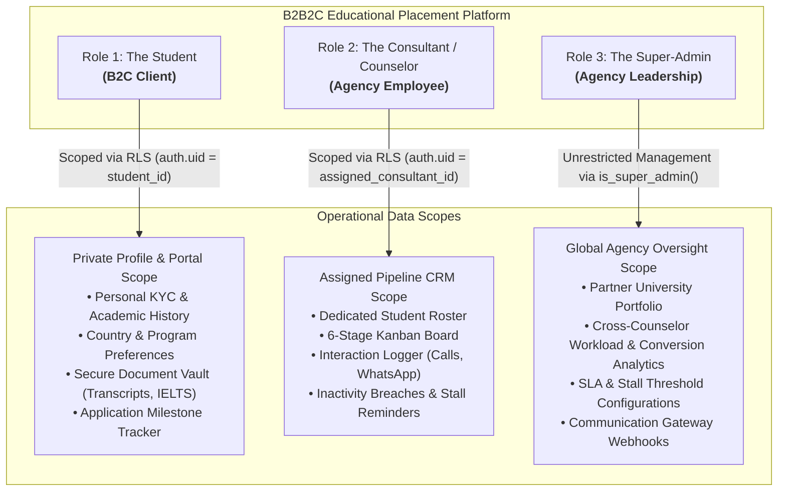
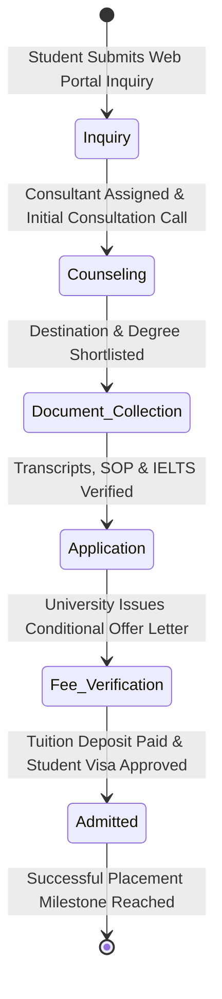
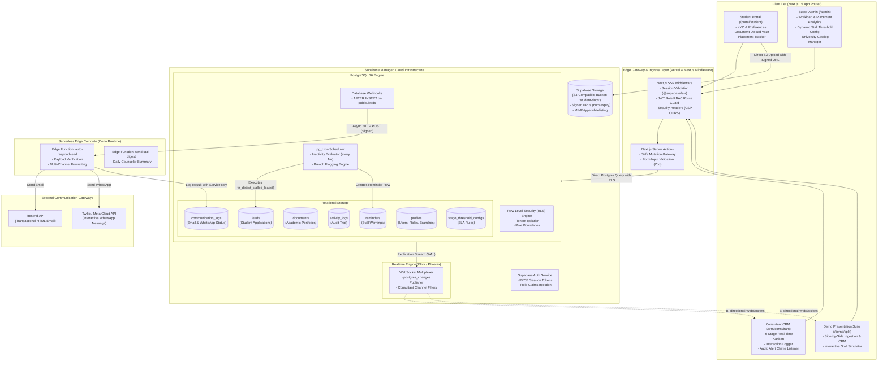
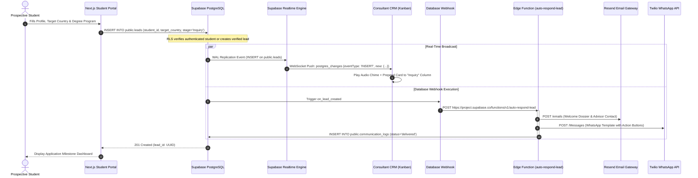
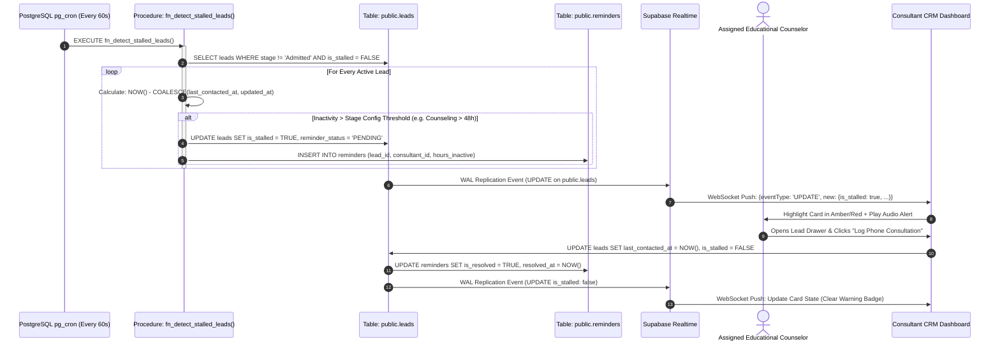
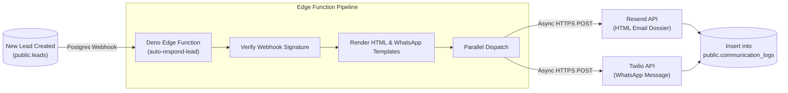

# B2B2C Educational Placement Agency CRM & Admission Lead Automation System
## Enterprise System Architecture & Cloud-Native Technical Specification

---

## Executive Summary & Architectural Paradigm Shift

This document details the production-grade, serverless cloud architecture, relational database schemas, Row-Level Security (RLS) policies, Next.js App Router frontend hierarchy, Supabase Realtime synchronization protocols, and asynchronous automation engines for the **Educational Placement & Advisory Agency CRM Platform**.

### From Monolithic Python to Modern Serverless BaaS
Previously architected as a monolithic Python service (Django REST Framework, Daphne ASGI, Celery, Redis, and APScheduler), the platform has pivoted to a **serverless, edge-ready cloud infrastructure** built on **Next.js (App Router)** and **Supabase (PostgreSQL 16, Realtime Engine, SSR Auth, S3-Compatible Storage, and Deno Edge Functions)**. 

```
┌─────────────────────────────────────────────────────────────────────────────────────────┐
│                               ARCHITECTURAL PIVOT MATRIX                                │
├────────────────────────────┬─────────────────────────────┬──────────────────────────────┤
│ Capability                 │ Legacy Monolithic Stack     │ Cloud-Native Supabase Pivot  │
├────────────────────────────┼─────────────────────────────┼──────────────────────────────┤
│ Core Framework & Ingress   │ Django REST Framework (DRF) │ Next.js App Router (Server   │
│                            │ on WSGI/Gunicorn            │ Actions + SSR Route Handlers)│
│ Real-Time Streaming        │ Daphne ASGI Server +        │ Supabase Realtime Engine     │
│                            │ Redis Channel Layer         │ (WebSockets / Elixir PubSub) │
│ Database & Security        │ PostgreSQL via Django ORM;  │ PostgreSQL 16 with native    │
│                            │ application-level permissions│ Row-Level Security (RLS)    │
│ Background Scheduling      │ APScheduler / Celery Beat   │ pg_cron (Native SQL Cron)    │
│ Outbound Auto-Response     │ Celery Worker + Redis Queue │ Database Webhooks +          │
│                            │                             │ Supabase Deno Edge Functions │
│ Document & File Storage    │ Local disk / Django storages│ Supabase Storage (S3 API)    │
│                            │                             │ with signed URL authorization│
│ Authentication & Sessions  │ Django Session / SimpleJWT  │ Supabase Auth (@supabase/ssr)│
│                            │                             │ with HTTP-Only PKCE cookies  │
└────────────────────────────┴─────────────────────────────┴──────────────────────────────┘
```

### The B2B2C Educational Placement Model
This product is **not a generic university admissions desk**. It is an enterprise **B2B2C Study-Abroad Placement & Advisory Agency Brokerage** (modeled after global education advisory leaders such as Chuolink, IDP, and ApplyBoard). 

The platform operates as an intermediary broker:
- **Prospective Students (B2C Clients)** leverage the agency to navigate international admissions, choose destinations, upload academic portfolios, and secure placement offers.
- **Agency Consultants (B2B Internal)** manage high-volume candidate pipelines, ensure compliance with partner university admissions criteria, log advisory sessions, and meet service-level agreements (SLAs).
- **Agency Super-Admins (Executive Leadership)** manage institutional relationships with partner universities across countries (UK, USA, Canada, Germany, Australia), track counselor conversion performance, optimize admission funnels, and mitigate lead drop-offs.

---

## 1. The 3-Role Agency Persona Model

The system enforces strict operational and data-access boundaries across three primary roles:



### Role 1: The Student (B2C Client)
- **Portal URL**: `/portal/student`
- **Key Workflows**:
  1. **Self-Onboarding**: Registers account, provides passport details, academic background (GPA, current degree), target intake year/season.
  2. **University & Destination Discovery**: Selects preferred destination countries (e.g., Canada, United Kingdom, United States, Germany, Ireland) and program specializations (e.g., MSc Data Science, MBA, BEng Software Engineering).
  3. **Digital Document Vault**: Directly uploads confidential materials (academic transcripts, language test scorecards like IELTS/TOEFL, Letters of Recommendation, Statements of Purpose, CV) to Supabase Storage with anti-tamper metadata.
  4. **Transparent Progress Tracking**: Monitors placement status across the 6 relational stages, receiving notification badges when their consultant advances their application or when partner universities request document revisions.

### Role 2: The Educational Consultant / Counselor (Agency Employee)
- **Portal URL**: `/crm/consultant`
- **Key Workflows**:
  1. **Assigned Pipeline Management**: Works inside a live 6-column Kanban board containing only the prospective students assigned to their specific portfolio.
  2. **Consultation & Interaction Logging**: Conducts advisory sessions and logs telephonic calls, WhatsApp guidance notes, or physical appointments directly into the candidate's activity timeline.
  3. **Document Verification**: Reviews uploaded academic records, verifies equivalency, and approves files or requests revisions from the student.
  4. **Stall Mitigation**: Tracks real-time inactivity badges. When an application stays idle beyond the stage SLA (e.g., 48 hours in Counseling without an interaction), the counselor receives instant audio and visual warnings to prompt follow-up.

### Role 3: The Super-Admin (Agency Owner / Director)
- **Portal URL**: `/admin`
- **Key Workflows**:
  1. **Agency Pipeline Governance**: Real-time visibility into all leads, consultants, applications, and institutional placement metrics across the organization.
  2. **Consultant Performance & Workload Balancing**: Evaluates counselor turnaround times, application-to-enrollment conversion rates, and redistributes lead allocations.
  3. **Configurable SLA & Stall Engine**: Dynamically tunes stage dwell-time thresholds (e.g., adjusting `Document Collection` stall limit from 72h to 48h during peak university deadlines).
  4. **Partner University Catalog**: Manages agreements, course catalogs, minimum grade cut-offs, and commission structures for partner educational institutions worldwide.

---

## 2. Core Works & Supabase Native Infrastructure Mapping

```
┌──────────────────────────────────────────────────────────────────────────────────────────────────┐
│                               SUPABASE NATIVE ARCHITECTURE MAPPING                               │
├─────────────────────────┬──────────────────────────────┬─────────────────────────────────────────┤
│ Major Work              │ Supabase Cloud Component     │ Mechanics & Low-Latency Execution Flow  │
├─────────────────────────┼──────────────────────────────┼─────────────────────────────────────────┤
│ Work 1:                 │ PostgreSQL 16 +              │ Form inserts directly to `leads` table. │
│ Real-Time Ingestion     │ Supabase Realtime Engine     │ PostgreSQL WAL publication broadcasts   │
│                         │ (postgres_changes)           │ row to Consultant WebSocket channel     │
│                         │                              │ without an intermediary application tier│
├─────────────────────────┼──────────────────────────────┼─────────────────────────────────────────┤
│ Work 2:                 │ PostgreSQL Database Webhooks │ Row creation triggers an async HTTP POST│
│ Instant Auto-Response   │ + Deno Supabase Edge         │ to `auto-respond-lead` Edge Function.   │
│                         │ Functions + Resend / Twilio  │ Function formats templates and pushes to│
│                         │                              │ Resend (Email) & Twilio (WhatsApp API). │
├─────────────────────────┼──────────────────────────────┼─────────────────────────────────────────┤
│ Work 3:                 │ Relational PostgreSQL Engine │ 6 strict stages governed by SQL Enum.   │
│ Stage Tracking & Funnel │ + Optimized Materialized SQL │ Relational foreign keys track university│
│                         │ Views & Generated Aggregates │ applications. Optimistic updates in UI  │
│                         │                              │ update state in <50ms.                  │
├─────────────────────────┼──────────────────────────────┼─────────────────────────────────────────┤
│ Work 4:                 │ pg_cron Extension +          │ pg_cron executes a stored procedure     │
│ Stall Reminder Engine   │ Stored SQL Procedures +      │ every minute. Breached rows are flagged,│
│                         │ Realtime Alert Pub/Sub       │ generating a `reminders` entry and      │
│                         │                              │ pushing an audio alert to counselors.   │
└─────────────────────────┴──────────────────────────────┴─────────────────────────────────────────┘
```

### Work 1: Real-Time Ingestion (Zero-Latency Lead Capture)
When a student completes an inquiry or an agency landing form submits, the Next.js frontend posts directly to Supabase via authenticated Server Actions or the client SDK with Row-Level Security:
1. The lead record is written to `public.leads` in PostgreSQL.
2. The PostgreSQL replication stream captures the `INSERT` via the `supabase_realtime` publication.
3. Supabase Realtime multiplexes the change across active WebSocket connections established by consultants.
4. The consultant assigned to that student receives the full payload in `<100ms`, rendering an entry card on their Kanban board and incrementing their active lead count without polling or custom ASGI web servers.

### Work 2: Instant Multi-Channel Auto-Response
Immediate engagement is critical to preventing prospective students from defecting to competing agencies:
1. An `AFTER INSERT` database webhook fires on `public.leads`.
2. Supabase dispatches a payload to a serverless Deno **Edge Function** (`auto-respond-lead`).
3. The Edge Function concurrently executes:
   - **Personalized HTML Email via Resend**: Sends an official onboarding guide, counselor direct contact details, and a magic link to activate their `/portal/student` dashboard.
   - **Direct WhatsApp Notification via Twilio / Meta Cloud API**: Delivers a verified business template containing reference numbers, program summary, and an instant interactive reply button.
4. The Edge Function logs the transmission status into `public.communication_logs`, linking directly to the student record for auditability.

### Work 3: Admission Stage Tracking & Funnel CRM
The agency workflow follows **6 strictly ordered relational stages**:
$$\text{Inquiry} \longrightarrow \text{Counseling} \longrightarrow \text{Document Collection} \longrightarrow \text{Application} \longrightarrow \text{Fee/Verification} \longrightarrow \text{Admitted}$$



- Every stage progression requires database-enforced integrity (foreign keys linking `student_id`, `assigned_consultant_id`, and `target_university_id`).
- Automated database triggers log every stage transition into `public.activity_logs`, recording `previous_stage`, `new_stage`, `changed_by_user_id`, and `dwell_time_seconds`.
- Conversion analytics and drop-off metrics are computed via high-performance database views without taxing the client tier.

### Work 4: Automated Stall Detection & Inactivity Remediation
To eliminate lead drop-offs caused by consultant delays, inactivity tracking is embedded natively in PostgreSQL:
1. The **`pg_cron`** extension schedules execution of `fn_detect_stalled_leads()` every minute.
2. The procedure scans all non-terminal leads and compares:
   $$\text{Inactivity Duration} = \text{NOW}() - \max(\text{last\_contacted\_at}, \text{updated\_at})$$
3. If inactivity exceeds the threshold defined in `stage_threshold_configs` for that specific stage, the procedure:
   - Marks the lead `is_stalled = TRUE`.
   - Inserts an actionable entry in `public.reminders`.
   - Records `STALL_DETECTED` in `public.activity_logs`.
4. Supabase Realtime detects the update and pushes a `STALL_ALERT` event down to the consultant's browser, triggering a visual warning badge and playing an audio alert chime.
5. When the consultant logs a call or communication, a trigger automatically sets `is_stalled = FALSE`, resolves the pending reminder, and resets the timer.

---

## 3. The 12-Factor App Methodology Alignment

This serverless Next.js and Supabase architecture is systematically engineered to adhere to the gold standard of cloud-native software: **The Twelve-Factor App**.

```
┌──────────────────────────────────────────────────────────────────────────────────────────────────┐
│                                 12-FACTOR APP ALIGNMENT MATRIX                                   │
├───────┬───────────────────────────┬──────────────────────────────────────────────────────────────┤
│ No.   │ Factor Name               │ Architectural Realization in Next.js + Supabase              │
├───────┼───────────────────────────┼──────────────────────────────────────────────────────────────┤
│ I     │ One Codebase, One Tracking│ Unified Git monorepo tracking explicit Next.js App Router    │
│       │                           │ domains (/portal/student, /crm/consultant, /admin).          │
│       │                           │ Same repository deployed across Local, Staging, Production.  │
├───────┼───────────────────────────┼──────────────────────────────────────────────────────────────┤
│ II    │ Explicit Dependencies     │ Strict isolation via package.json lockfiles (pnpm-lock.yaml) │
│       │                           │ executed with `npm ci` / `pnpm install --frozen-lockfile`.   │
│       │                           │ Deno Edge Functions declare pinned URL imports (std@0.224.0).│
├───────┼───────────────────────────┼──────────────────────────────────────────────────────────────┤
│ III   │ Config in Environment     │ Zero hardcoded secrets. All credentials injected at runtime  │
│       │                           │ via Vercel and Supabase vaults. Client permissions validated │
│       │                           │ cryptographically via Supabase JWT claims (app_metadata).    │
├───────┼───────────────────────────┼──────────────────────────────────────────────────────────────┤
│ IV    │ Backing Services as       │ PostgreSQL, Supabase Storage, Resend API, and Twilio WhatsApp│
│       │ Attached Resources        │ treated as attached cloud handles swappable via env URLs     │
│       │                           │ without changing application source code.                    │
├───────┼───────────────────────────┼──────────────────────────────────────────────────────────────┤
│ V     │ Strict Build, Release,    │ GitHub Actions CI validates types, runs tests, and creates   │
│       │ Run Separation            │ immutable Next.js builds. Release bundles are versioned and  │
│       │                           │ deployed atomically to Vercel and Supabase Edge infrastructure│
├───────┼───────────────────────────┼──────────────────────────────────────────────────────────────┤
│ VI    │ Stateless Processes       │ Next.js instances run 100% stateless on serverless edge nodes│
│       │                           │ Session state is persisted in encrypted, HTTP-Only cookies;  │
│       │                           │ shared operational state lives in PostgreSQL.                │
├───────┼───────────────────────────┼──────────────────────────────────────────────────────────────┤
│ VII   │ Port Binding              │ Next.js exports self-contained web services by binding to    │
│       │                           │ $PORT (default :3000) locally, while Vercel Serverless binds │
│       │                           │ directly to dynamic HTTP execution runtimes.                 │
├───────┼───────────────────────────┼──────────────────────────────────────────────────────────────┤
│ VIII  │ Concurrency & Scaling     │ Frontend scales horizontally across global edge locations.   │
│       │                           │ Supabase handles DB concurrency via Supavisor connection     │
│       │                           │ pooling, handling thousands of concurrent client requests.   │
├───────┼───────────────────────────┼──────────────────────────────────────────────────────────────┤
│ IX    │ Disposability             │ Serverless Edge Functions spin up in <50ms and shut down     │
│       │                           │ immediately after request resolution. DB transactions use    │
│       │                           │ strict timeouts to prevent connection exhaustion.            │
├───────┼───────────────────────────┼──────────────────────────────────────────────────────────────┤
│ X     │ Dev/Prod Parity           │ Supabase CLI runs exact Docker container versions of         │
│       │                           │ PostgreSQL 16, pg_cron, and Auth locally, eliminating        │
│       │                           │ disparities between developer laptops and production.        │
├───────┼───────────────────────────┼──────────────────────────────────────────────────────────────┤
│ XI    │ Logs as Event Streams     │ Application logs and database write events are treated as    │
│       │                           │ continuous event streams, ingested by Supabase Logflare,     │
│       │                           │ Axiom, or Datadog without local logfile dependencies.        │
├───────┼───────────────────────────┼──────────────────────────────────────────────────────────────┤
│ XII   │ Admin Processes as        │ Database migrations, batch lead re-assignments, and seed     │
│       │ One-Off Tasks             │ routines run as automated CLI tasks (`supabase db push`) or  │
│       │                           │ authenticated isolated scripts, never via ad-hoc UI buttons. │
└───────┴───────────────────────────┴──────────────────────────────────────────────────────────────┘
```

---

## 4. End-to-End System Architecture & Cloud Topology



---

## 5. Low-Level Sequence Diagrams

### 5.1 Sequence 1: Student Submission → Supabase Ingestion → Realtime Sync & Auto-Response



### 5.2 Sequence 2: Scheduled Stall Evaluation, Alerting & Counselor Resolution



---

## 6. Complete PostgreSQL Relational Database Schema & Data Models

The entire persistence tier is executed in PostgreSQL 16 using native UUIDs, TIMESTAMPTZ, JSONB for metadata flexibility, and strict foreign keys.


### 6.1 Database Schema DDL (`supabase/migrations/20260911000001_core_schema.sql`)

```sql
-- Enable necessary extensions
CREATE EXTENSION IF NOT EXISTS "uuid-ossp";
CREATE EXTENSION IF NOT EXISTS "pg_cron";

-- Create Enums
CREATE TYPE user_role AS ENUM ('student', 'consultant', 'super_admin');
CREATE TYPE admission_stage AS ENUM (
    'Inquiry', 
    'Counseling', 
    'Document Collection', 
    'Application', 
    'Fee/Verification', 
    'Admitted'
);
CREATE TYPE doc_type AS ENUM ('TRANSCRIPT', 'IELTS_SCORECARD', 'PASSPORT', 'STATEMENT_OF_PURPOSE', 'RESUME');
CREATE TYPE doc_status AS ENUM ('PENDING', 'VERIFIED', 'REJECTED');
CREATE TYPE comm_channel AS ENUM ('EMAIL', 'WHATSAPP', 'SMS');
CREATE TYPE comm_status AS ENUM ('QUEUED', 'DELIVERED', 'FAILED', 'READ');

-- 1. Profiles Table (Linked to Supabase auth.users)
CREATE TABLE public.profiles (
    id UUID PRIMARY KEY REFERENCES auth.users(id) ON DELETE CASCADE,
    email TEXT NOT NULL UNIQUE,
    full_name TEXT NOT NULL,
    role user_role NOT NULL DEFAULT 'student',
    phone TEXT,
    branch_location TEXT DEFAULT 'Global Online',
    avatar_url TEXT,
    created_at TIMESTAMPTZ NOT NULL DEFAULT TIMEZONE('utc', NOW()),
    updated_at TIMESTAMPTZ NOT NULL DEFAULT TIMEZONE('utc', NOW())
);

-- 2. Partner Universities & Degree Programs Catalog
CREATE TABLE public.universities (
    id UUID PRIMARY KEY DEFAULT gen_random_uuid(),
    name TEXT NOT NULL,
    country TEXT NOT NULL,
    city TEXT NOT NULL,
    ranking_global INTEGER,
    partnership_tier TEXT DEFAULT 'Standard', -- 'Standard', 'Preferred', 'Direct Agreement'
    is_active BOOLEAN NOT NULL DEFAULT TRUE,
    created_at TIMESTAMPTZ NOT NULL DEFAULT TIMEZONE('utc', NOW())
);

CREATE TABLE public.programs (
    id UUID PRIMARY KEY DEFAULT gen_random_uuid(),
    university_id UUID NOT NULL REFERENCES public.universities(id) ON DELETE CASCADE,
    program_name TEXT NOT NULL,
    degree_level TEXT NOT NULL, -- 'BSc', 'MSc', 'MBA', 'Diploma'
    annual_tuition_usd NUMERIC(10, 2),
    intake_seasons TEXT[] DEFAULT ARRAY['Fall', 'Spring'],
    is_active BOOLEAN NOT NULL DEFAULT TRUE,
    created_at TIMESTAMPTZ NOT NULL DEFAULT TIMEZONE('utc', NOW())
);

-- 3. Leads (Student Applications Pipeline)
CREATE TABLE public.leads (
    id UUID PRIMARY KEY DEFAULT gen_random_uuid(),
    student_id UUID NOT NULL REFERENCES public.profiles(id) ON DELETE CASCADE,
    assigned_consultant_id UUID REFERENCES public.profiles(id) ON DELETE SET NULL,
    program_id UUID REFERENCES public.programs(id) ON DELETE SET NULL,
    target_country TEXT NOT NULL,
    stage admission_stage NOT NULL DEFAULT 'Inquiry',
    is_stalled BOOLEAN NOT NULL DEFAULT FALSE,
    reminder_status TEXT NOT NULL DEFAULT 'NONE', -- 'NONE', 'PENDING', 'RESOLVED'
    notes TEXT,
    metadata JSONB DEFAULT '{
        "gpa": null,
        "ielts_overall": null,
        "target_intake": "Fall 2027",
        "budget_range_usd": "25k-40k"
    }'::jsonb,
    last_contacted_at TIMESTAMPTZ,
    created_at TIMESTAMPTZ NOT NULL DEFAULT TIMEZONE('utc', NOW()),
    updated_at TIMESTAMPTZ NOT NULL DEFAULT TIMEZONE('utc', NOW())
);

-- Indexes for performance
CREATE INDEX idx_leads_student ON public.leads(student_id);
CREATE INDEX idx_leads_consultant ON public.leads(assigned_consultant_id);
CREATE INDEX idx_leads_stage ON public.leads(stage);
CREATE INDEX idx_leads_stalled ON public.leads(is_stalled) WHERE is_stalled = TRUE;
CREATE INDEX idx_leads_updated ON public.leads(updated_at);

-- 4. Academic Documents Vault
CREATE TABLE public.documents (
    id UUID PRIMARY KEY DEFAULT gen_random_uuid(),
    lead_id UUID NOT NULL REFERENCES public.leads(id) ON DELETE CASCADE,
    document_type doc_type NOT NULL,
    file_name TEXT NOT NULL,
    storage_path TEXT NOT NULL,
    file_size_bytes BIGINT NOT NULL,
    mime_type TEXT NOT NULL,
    verification_status doc_status NOT NULL DEFAULT 'PENDING',
    review_notes TEXT,
    uploaded_at TIMESTAMPTZ NOT NULL DEFAULT TIMEZONE('utc', NOW())
);

-- 5. Activity Audit Trail
CREATE TABLE public.activity_logs (
    id UUID PRIMARY KEY DEFAULT gen_random_uuid(),
    lead_id UUID NOT NULL REFERENCES public.leads(id) ON DELETE CASCADE,
    actor_id UUID REFERENCES public.profiles(id) ON DELETE SET NULL,
    action_type TEXT NOT NULL, -- 'CREATED', 'STAGE_TRANSITION', 'NOTE_ADDED', 'CALL_LOGGED', 'STALL_TRIGGERED'
    details TEXT NOT NULL,
    change_payload JSONB DEFAULT '{}'::jsonb,
    created_at TIMESTAMPTZ NOT NULL DEFAULT TIMEZONE('utc', NOW())
);

-- 6. Communication Logs
CREATE TABLE public.communication_logs (
    id UUID PRIMARY KEY DEFAULT gen_random_uuid(),
    lead_id UUID NOT NULL REFERENCES public.leads(id) ON DELETE CASCADE,
    channel comm_channel NOT NULL,
    recipient TEXT NOT NULL,
    subject TEXT,
    content_snippet TEXT NOT NULL,
    external_message_id TEXT,
    status comm_status NOT NULL DEFAULT 'QUEUED',
    sent_at TIMESTAMPTZ NOT NULL DEFAULT TIMEZONE('utc', NOW())
);

-- 7. Stall Reminders
CREATE TABLE public.reminders (
    id UUID PRIMARY KEY DEFAULT gen_random_uuid(),
    lead_id UUID NOT NULL REFERENCES public.leads(id) ON DELETE CASCADE,
    consultant_id UUID REFERENCES public.profiles(id) ON DELETE CASCADE,
    stage_at_stall admission_stage NOT NULL,
    hours_inactive NUMERIC(6, 1) NOT NULL,
    message TEXT NOT NULL,
    is_resolved BOOLEAN NOT NULL DEFAULT FALSE,
    created_at TIMESTAMPTZ NOT NULL DEFAULT TIMEZONE('utc', NOW()),
    resolved_at TIMESTAMPTZ
);

-- 8. Configurable Stage SLA Thresholds
CREATE TABLE public.stage_threshold_configs (
    stage admission_stage PRIMARY KEY,
    threshold_hours INTEGER NOT NULL,
    severity TEXT NOT NULL DEFAULT 'MEDIUM',
    updated_at TIMESTAMPTZ NOT NULL DEFAULT TIMEZONE('utc', NOW())
);

-- Seed Default SLA Thresholds
INSERT INTO public.stage_threshold_configs (stage, threshold_hours, severity) VALUES
('Inquiry', 24, 'HIGH'),
('Counseling', 48, 'MEDIUM'),
('Document Collection', 72, 'MEDIUM'),
('Application', 48, 'HIGH'),
('Fee/Verification', 24, 'CRITICAL'),
('Admitted', 999999, 'NONE');
```

---

### 6.2 Complete Row-Level Security (RLS) Policies

Row-Level Security guarantees zero data leakage across our multi-tenant 3-role persona model. All queries are evaluated dynamically against the cryptographically verified `auth.jwt()`.

```sql
-- Enable RLS across all sensitive tables
ALTER TABLE public.profiles ENABLE ROW LEVEL SECURITY;
ALTER TABLE public.leads ENABLE ROW LEVEL SECURITY;
ALTER TABLE public.documents ENABLE ROW LEVEL SECURITY;
ALTER TABLE public.activity_logs ENABLE ROW LEVEL SECURITY;
ALTER TABLE public.communication_logs ENABLE ROW LEVEL SECURITY;
ALTER TABLE public.reminders ENABLE ROW LEVEL SECURITY;
ALTER TABLE public.stage_threshold_configs ENABLE ROW LEVEL SECURITY;

-- Helper function: Check if current user is Super Admin
CREATE OR REPLACE FUNCTION public.is_super_admin()
RETURNS BOOLEAN LANGUAGE sql STABLE AS $$
    SELECT EXISTS (
        SELECT 1 FROM public.profiles
        WHERE id = auth.uid() AND role = 'super_admin'
    );
$$;

-- Helper function: Check if current user is Consultant
CREATE OR REPLACE FUNCTION public.is_consultant()
RETURNS BOOLEAN LANGUAGE sql STABLE AS $$
    SELECT EXISTS (
        SELECT 1 FROM public.profiles
        WHERE id = auth.uid() AND role = 'consultant'
    );
$$;

--------------------------------------------------------------------------------
-- 1. PROFILES POLICIES
--------------------------------------------------------------------------------
-- Users can view their own profile
CREATE POLICY "Users can read own profile"
    ON public.profiles FOR SELECT
    USING (auth.uid() = id OR public.is_super_admin() OR public.is_consultant());

-- Users can update only their own profile
CREATE POLICY "Users can update own profile"
    ON public.profiles FOR UPDATE
    USING (auth.uid() = id);

--------------------------------------------------------------------------------
-- 2. LEADS POLICIES (CORE 3-ROLE ENFORCEMENT)
--------------------------------------------------------------------------------
-- Role 1 (Student): Read own application records
CREATE POLICY "Students can view own applications"
    ON public.leads FOR SELECT
    USING (auth.uid() = student_id);

-- Role 1 (Student): Create inquiry
CREATE POLICY "Students can insert own application"
    ON public.leads FOR INSERT
    WITH CHECK (auth.uid() = student_id);

-- Role 2 (Consultant): View assigned student leads
CREATE POLICY "Consultants can view assigned leads"
    ON public.leads FOR SELECT
    USING (auth.uid() = assigned_consultant_id);

-- Role 2 (Consultant): Update stage, notes, and contact time for assigned leads
CREATE POLICY "Consultants can update assigned leads"
    ON public.leads FOR UPDATE
    USING (auth.uid() = assigned_consultant_id);

-- Role 3 (Super Admin): Full unrestricted access
CREATE POLICY "Super Admins have full access to leads"
    ON public.leads FOR ALL
    USING (public.is_super_admin());

--------------------------------------------------------------------------------
-- 3. DOCUMENTS VAULT POLICIES
--------------------------------------------------------------------------------
-- Students can view their uploaded files
CREATE POLICY "Students view own documents"
    ON public.documents FOR SELECT
    USING (EXISTS (
        SELECT 1 FROM public.leads 
        WHERE leads.id = documents.lead_id AND leads.student_id = auth.uid()
    ));

-- Students can insert documents for their applications
CREATE POLICY "Students upload documents to own applications"
    ON public.documents FOR INSERT
    WITH CHECK (EXISTS (
        SELECT 1 FROM public.leads 
        WHERE leads.id = documents.lead_id AND leads.student_id = auth.uid()
    ));

-- Consultants can review documents for assigned students
CREATE POLICY "Consultants view assigned student documents"
    ON public.documents FOR SELECT
    USING (EXISTS (
        SELECT 1 FROM public.leads 
        WHERE leads.id = documents.lead_id AND leads.assigned_consultant_id = auth.uid()
    ));

CREATE POLICY "Consultants verify assigned student documents"
    ON public.documents FOR UPDATE
    USING (EXISTS (
        SELECT 1 FROM public.leads 
        WHERE leads.id = documents.lead_id AND leads.assigned_consultant_id = auth.uid()
    ));

-- Super Admin: Full documents access
CREATE POLICY "Admins full document access"
    ON public.documents FOR ALL
    USING (public.is_super_admin());

--------------------------------------------------------------------------------
-- 4. REMINDERS POLICIES
--------------------------------------------------------------------------------
-- Consultants can view and resolve their own reminders
CREATE POLICY "Consultants manage own reminders"
    ON public.reminders FOR ALL
    USING (auth.uid() = consultant_id OR public.is_super_admin());
```

---

### 6.3 Automation Procedures, Triggers, & pg_cron Scheduling

```sql
--------------------------------------------------------------------------------
-- 1. Automatic Timestamp & Stage Transition Audit Trigger
--------------------------------------------------------------------------------
CREATE OR REPLACE FUNCTION public.fn_audit_lead_changes()
RETURNS TRIGGER AS $$
BEGIN
    NEW.updated_at = TIMEZONE('utc', NOW());
    
    -- Detect stage change and record audit log
    IF (OLD.stage IS DISTINCT FROM NEW.stage) THEN
        INSERT INTO public.activity_logs (
            lead_id, 
            actor_id, 
            action_type, 
            details,
            change_payload
        ) VALUES (
            NEW.id,
            auth.uid(),
            'STAGE_TRANSITION',
            FORMAT('Stage moved from %s to %s', OLD.stage, NEW.stage),
            jsonb_build_object('old_stage', OLD.stage, 'new_stage', NEW.stage)
        );
    END IF;

    RETURN NEW;
END;
$$ LANGUAGE plpgsql SECURITY DEFINER;

CREATE TRIGGER tr_audit_lead_changes
    BEFORE UPDATE ON public.leads
    FOR EACH ROW
    EXECUTE FUNCTION public.fn_audit_lead_changes();

--------------------------------------------------------------------------------
-- 2. Stored Procedure: Inactivity & Stall Evaluator (Executed by pg_cron)
--------------------------------------------------------------------------------
CREATE OR REPLACE FUNCTION public.fn_detect_stalled_leads()
RETURNS void AS $$
DECLARE
    r RECORD;
    v_threshold INTEGER;
    v_hours_inactive NUMERIC;
    v_now TIMESTAMPTZ := TIMEZONE('utc', NOW());
BEGIN
    -- Query all active, non-admitted leads that are not currently marked stalled
    FOR r IN 
        SELECT l.id, l.student_id, l.assigned_consultant_id, l.stage,
               p.full_name AS student_name,
               COALESCE(l.last_contacted_at, l.updated_at) AS reference_time
        FROM public.leads l
        JOIN public.profiles p ON l.student_id = p.id
        WHERE l.stage != 'Admitted' AND l.is_stalled = FALSE
    LOOP
        -- Fetch threshold for this specific stage
        SELECT threshold_hours INTO v_threshold
        FROM public.stage_threshold_configs
        WHERE stage = r.stage;

        IF v_threshold IS NOT NULL THEN
            -- Calculate elapsed hours
            v_hours_inactive := ROUND(EXTRACT(EPOCH FROM (v_now - r.reference_time)) / 3600.0, 1);

            IF v_hours_inactive >= v_threshold THEN
                -- 1. Mark the lead as stalled
                UPDATE public.leads 
                SET is_stalled = TRUE, 
                    reminder_status = 'PENDING',
                    updated_at = v_now
                WHERE id = r.id;

                -- 2. Insert reminder if no active unresolved reminder exists
                IF NOT EXISTS (
                    SELECT 1 FROM public.reminders 
                    WHERE lead_id = r.id AND stage_at_stall = r.stage AND is_resolved = FALSE
                ) THEN
                    INSERT INTO public.reminders (
                        lead_id,
                        consultant_id,
                        stage_at_stall,
                        hours_inactive,
                        message
                    ) VALUES (
                        r.id,
                        r.assigned_consultant_id,
                        r.stage,
                        v_hours_inactive,
                        FORMAT('SLA Breach: %s has been inactive in %s for %s hours. Urgent advisory contact required.', 
                               r.student_name, r.stage, v_hours_inactive)
                    );

                    -- 3. Log audit event
                    INSERT INTO public.activity_logs (
                        lead_id,
                        actor_id,
                        action_type,
                        details
                    ) VALUES (
                        r.id,
                        NULL,
                        'STALL_TRIGGERED',
                        FORMAT('Automated SLA breach detected: %s hrs inactive in %s', v_hours_inactive, r.stage)
                    );
                END IF;
            END IF;
        END IF;
    END LOOP;
END;
$$ LANGUAGE plpgsql SECURITY DEFINER;

--------------------------------------------------------------------------------
-- 3. Schedule with pg_cron (Every 60 Seconds in Production)
--------------------------------------------------------------------------------
SELECT cron.schedule(
    'evaluate-stalled-leads-every-minute',
    '* * * * *',
    'SELECT public.fn_detect_stalled_leads();'
);
```

---

## 7. Supabase Realtime Protocol & WebSocket Subscriptions

The platform uses native **Supabase Realtime** backed by PostgreSQL's logical replication stream (`wal2json` / `pgoutput`). Consultants and operators establish persistent WebSocket connections authenticated via Supabase JWTs.

### 7.1 Enable Table Replication
```sql
-- Register sensitive tables with the supabase_realtime publication
ALTER PUBLICATION supabase_realtime ADD TABLE public.leads;
ALTER PUBLICATION supabase_realtime ADD TABLE public.reminders;
ALTER PUBLICATION supabase_realtime ADD TABLE public.activity_logs;
```

### 7.2 Realtime Subscription Payloads

#### Payload 1: `NEW_LEAD` (`INSERT` on `public.leads`)
```json
{
  "schema": "public",
  "table": "leads",
  "commit_timestamp": "2026-09-11T04:15:20.123Z",
  "eventType": "INSERT",
  "new": {
    "id": "7b6b1580-c247-495d-bca7-eef4d2f09101",
    "student_id": "99ea7cb1-4475-476c-8eb1-46bb9e2bf405",
    "assigned_consultant_id": "a4d33932-d85c-4a3e-b52b-7c001e4a1122",
    "program_id": "3c3ef841-8608-4bf8-bfa3-0d1275bbfa88",
    "target_country": "Canada",
    "stage": "Inquiry",
    "is_stalled": false,
    "reminder_status": "NONE",
    "metadata": {
      "gpa": "3.85",
      "ielts_overall": "7.5",
      "target_intake": "Fall 2027"
    },
    "last_contacted_at": null,
    "created_at": "2026-09-11T04:15:20.100Z",
    "updated_at": "2026-09-11T04:15:20.100Z"
  },
  "old": null,
  "errors": null
}
```

#### Payload 2: `STALL_ALERT` (`UPDATE` on `public.leads`)
```json
{
  "schema": "public",
  "table": "leads",
  "commit_timestamp": "2026-09-11T04:16:00.005Z",
  "eventType": "UPDATE",
  "new": {
    "id": "7b6b1580-c247-495d-bca7-eef4d2f09101",
    "stage": "Counseling",
    "is_stalled": true,
    "reminder_status": "PENDING",
    "updated_at": "2026-09-11T04:16:00.000Z"
  },
  "old": {
    "id": "7b6b1580-c247-495d-bca7-eef4d2f09101",
    "is_stalled": false,
    "reminder_status": "NONE"
  }
}
```

### 7.3 Production Client-Side Subscription Hook (`src/hooks/useSupabaseRealtime.ts`)
Handles strict channel unsubscription, memory leak prevention, optimistic updates, and audio chime triggering:

```typescript
'use client';

import { useEffect, useRef } from 'react';
import { createClient } from '@/services/supabase/client';
import type { Lead } from '@/types/database';

interface RealtimeConfig {
  consultantId?: string;
  onLeadInsert?: (lead: Lead) => void;
  onLeadUpdate?: (lead: Lead) => void;
  onStallBreach?: (lead: Lead) => void;
}

export function useSupabaseRealtime({
  consultantId,
  onLeadInsert,
  onLeadUpdate,
  onStallBreach,
}: RealtimeConfig) {
  const supabase = createClient();
  const audioRef = useRef<HTMLAudioElement | null>(null);

  useEffect(() => {
    // Lazy-load alert sound chime
    audioRef.current = new Audio('/audio/lead-chime.mp3');

    // Scoped channel filter: Listen only to relevant events
    const filter = consultantId
      ? `assigned_consultant_id=eq.${consultantId}`
      : undefined;

    const channel = supabase
      .channel('consultant-crm-pipeline')
      .on(
        'postgres_changes',
        {
          event: 'INSERT',
          schema: 'public',
          table: 'leads',
          filter,
        },
        (payload) => {
          const newLead = payload.new as Lead;
          audioRef.current?.play().catch(() => {}); // Graceful handling of browser autoplay policies
          onLeadInsert?.(newLead);
        }
      )
      .on(
        'postgres_changes',
        {
          event: 'UPDATE',
          schema: 'public',
          table: 'leads',
          filter,
        },
        (payload) => {
          const updatedLead = payload.new as Lead;
          if (updatedLead.is_stalled && !payload.old?.is_stalled) {
            audioRef.current?.play().catch(() => {});
            onStallBreach?.(updatedLead);
          }
          onLeadUpdate?.(updatedLead);
        }
      )
      .subscribe((status) => {
        if (status === 'SUBSCRIBED') {
          console.info('Connected to Supabase Realtime Pipeline Channel');
        }
      });

    // Mandatory clean-up to prevent duplicate event subscriptions
    return () => {
      supabase.removeChannel(channel);
    };
  }, [consultantId, onLeadInsert, onLeadUpdate, onStallBreach]);
}
```

---

## 8. Serverless Edge Functions & Auto-Response Engine

Supabase Edge Functions are powered by the **Deno** runtime, running globally at the edge with cold-start times under 50 milliseconds.



### 8.1 Edge Function Implementation (`supabase/functions/auto-respond-lead/index.ts`)

```typescript
import { serve } from "https://deno.land/std@0.224.0/http/server.ts";
import { createClient } from "https://esm.sh/@supabase/supabase-js@2.45.0";

const RESEND_API_KEY = Deno.env.get("RESEND_API_KEY")!;
const TWILIO_ACCOUNT_SID = Deno.env.get("TWILIO_ACCOUNT_SID")!;
const TWILIO_AUTH_TOKEN = Deno.env.get("TWILIO_AUTH_TOKEN")!;
const TWILIO_PHONE_NUMBER = Deno.env.get("TWILIO_PHONE_NUMBER")!;
const SUPABASE_URL = Deno.env.get("SUPABASE_URL")!;
const SUPABASE_SERVICE_ROLE_KEY = Deno.env.get("SUPABASE_SERVICE_ROLE_KEY")!;

// Service Role client to bypass RLS for internal logging
const supabaseAdmin = createClient(SUPABASE_URL, SUPABASE_SERVICE_ROLE_KEY);

serve(async (req) => {
  try {
    const payload = await req.json();
    const { record: lead } = payload; // Supabase Webhook payload format

    if (!lead || !lead.id) {
      return new Response("Missing lead record", { status: 400 });
    }

    // Fetch student profile details
    const { data: student, error: studentErr } = await supabaseAdmin
      .from("profiles")
      .select("email, full_name, phone")
      .eq("id", lead.student_id)
      .single();

    if (studentErr || !student) {
      throw new Error(`Student not found: ${studentErr?.message}`);
    }

    // Parallel Outbound Execution: Resend Email + Twilio WhatsApp
    const [emailRes, whatsappRes] = await Promise.allSettled([
      // 1. Send HTML Email via Resend
      fetch("https://api.resend.com/emails", {
        method: "POST",
        headers: {
          Authorization: `Bearer ${RESEND_API_KEY}`,
          "Content-Type": "application/json",
        },
        body: JSON.stringify({
          from: "Global Admissions Office <admissions@agencybroker.com>",
          to: student.email,
          subject: `Application Dossier Received – Welcome, ${student.full_name}`,
          html: `
            <div style="font-family: sans-serif; max-width: 600px; margin: 0 auto; padding: 20px;">
              <h2>Welcome to Global Study Admissions, ${student.full_name}!</h2>
              <p>Your admission inquiry for target destination <strong>${lead.target_country}</strong> has been registered with Reference ID: <code>#${lead.id}</code>.</p>
              <p>Your designated Educational Advisor will contact you within 24 hours to schedule your preliminary university matching interview.</p>
              <p><a href="https://agencybroker.com/portal/student" style="background:#2563eb;color:#fff;padding:10px 18px;text-decoration:none;border-radius:6px;display:inline-block;">Access Student Portal</a></p>
            </div>
          `,
        }),
      }),

      // 2. Send WhatsApp Notification via Twilio
      student.phone
        ? fetch(`https://api.twilio.com/2010-04-01/Accounts/${TWILIO_ACCOUNT_SID}/Messages.json`, {
            method: "POST",
            headers: {
              Authorization: `Basic ${btoa(`${TWILIO_ACCOUNT_SID}:${TWILIO_AUTH_TOKEN}`)}`,
              "Content-Type": "application/x-www-form-urlencoded",
            },
            body: new URLSearchParams({
              From: `whatsapp:${TWILIO_PHONE_NUMBER}`,
              To: `whatsapp:${student.phone}`,
              Body: `🎓 *Admissions Dossier Confirmed, ${student.full_name}!*\n\nWe received your inquiry for ${lead.target_country} (Ref: #${lead.id.substring(0, 8)}).\n\nYour assigned consultant is reviewing university admission requirements. Access your portal to upload marksheets and IELTS scorecards.`,
            }),
          })
        : Promise.resolve(null),
    ]);

    // Record Logs in public.communication_logs
    await supabaseAdmin.from("communication_logs").insert([
      {
        lead_id: lead.id,
        channel: "EMAIL",
        recipient: student.email,
        subject: `Application Dossier Received – Welcome, ${student.full_name}`,
        content_snippet: `Welcome dossier dispatched with ID #${lead.id}`,
        status: emailRes.status === "fulfilled" ? "DELIVERED" : "FAILED",
      },
      ...(student.phone
        ? [
            {
              lead_id: lead.id,
              channel: "WHATSAPP",
              recipient: student.phone,
              subject: "WhatsApp Instant Acknowledgement",
              content_snippet: `WhatsApp notification dispatched to ${student.phone}`,
              status: whatsappRes.status === "fulfilled" ? "DELIVERED" : "FAILED",
            },
          ]
        : []),
    ]);

    return new Response(JSON.stringify({ success: true }), {
      headers: { "Content-Type": "application/json" },
      status: 200,
    });
  } catch (error) {
    return new Response(JSON.stringify({ error: (error as Error).message }), {
      headers: { "Content-Type": "application/json" },
      status: 500,
    });
  }
});
```

---

## 9. Next.js 15 Application Frontend Architecture

The frontend is structured around the **Next.js 15 App Router** leveraging React 19 Server Components, SSR Cookie Validation (`@supabase/ssr`), and optimistic client components for Kanban operations.

### 9.1 Middleware Authentication & RBAC Guard (`src/middleware.ts`)
Protects routes, refreshes auth session cookies, and directs users according to their persona role:

```typescript
import { createServerClient } from '@supabase/ssr';
import { NextResponse, type NextRequest } from 'next/server';

export async function middleware(request: NextRequest) {
  let response = NextResponse.next({
    request: { headers: request.headers },
  });

  const supabase = createServerClient(
    process.env.NEXT_PUBLIC_SUPABASE_URL!,
    process.env.NEXT_PUBLIC_SUPABASE_ANON_KEY!,
    {
      cookies: {
        getAll: () => request.cookies.getAll(),
        setAll: (cookiesToSet) => {
          cookiesToSet.forEach(({ name, value, options }) =>
            response.cookies.set(name, value, options)
          );
        },
      },
    }
  );

  // Refresh auth session
  const { data: { user } } = await supabase.auth.getUser();
  const path = request.nextUrl.pathname;

  // Unauthenticated users attempting to access protected domains
  if (!user && (path.startsWith('/portal') || path.startsWith('/crm') || path.startsWith('/admin'))) {
    return NextResponse.redirect(new URL('/auth/login', request.url));
  }

  if (user) {
    // Fetch profile role
    const { data: profile } = await supabase
      .from('profiles')
      .select('role')
      .eq('id', user.id)
      .single();

    const role = profile?.role;

    // RBAC Route Boundary Enforcement
    if (path.startsWith('/admin') && role !== 'super_admin') {
      return NextResponse.redirect(new URL('/crm/consultant', request.url));
    }

    if (path.startsWith('/crm') && role === 'student') {
      return NextResponse.redirect(new URL('/portal/student', request.url));
    }

    if (path.startsWith('/portal') && (role === 'consultant' || role === 'super_admin')) {
      // Allow agency staff to preview student portal or redirect
    }
  }

  return response;
}

export const config = {
  matcher: ['/portal/:path*', '/crm/:path*', '/admin/:path*'],
};
```

### 9.2 Optimistic UI Kanban Implementation (`src/components/crm/PipelineKanban.tsx`)
Enables drag-and-drop or one-click stage movements with **0ms UI latency** using optimistic React state updates with automatic rollback on network failure:

```tsx
'use client';

import React, { useOptimistic, useTransition } from 'react';
import { updateLeadStageAction } from '@/app/actions/leadActions';
import type { Lead, AdmissionStage } from '@/types/database';

const STAGES: AdmissionStage[] = [
  'Inquiry',
  'Counseling',
  'Document Collection',
  'Application',
  'Fee/Verification',
  'Admitted',
];

interface KanbanProps {
  initialLeads: Lead[];
}

export function PipelineKanban({ initialLeads }: KanbanProps) {
  const [, startTransition] = useTransition();

  // Optimistic UI state handler
  const [optimisticLeads, setOptimisticLeads] = useOptimistic(
    initialLeads,
    (state, update: { leadId: string; newStage: AdmissionStage }) => {
      return state.map((lead) =>
        lead.id === update.leadId ? { ...lead, stage: update.newStage } : lead
      );
    }
  );

  const handleStageMove = async (leadId: string, newStage: AdmissionStage) => {
    // 1. Instant Optimistic Render (0ms perceived latency)
    startTransition(() => {
      setOptimisticLeads({ leadId, newStage });
    });

    // 2. Asynchronous Server Action Execution
    const result = await updateLeadStageAction(leadId, newStage);
    if (!result.success) {
      alert(`Failed to update stage: ${result.error}`);
      // State automatically rolls back if server action fails
    }
  };

  return (
    <div className="grid grid-cols-6 gap-4 overflow-x-auto pb-4">
      {STAGES.map((stage) => {
        const stageLeads = optimisticLeads.filter((l) => l.stage === stage);
        return (
          <div key={stage} className="bg-slate-900/60 rounded-xl p-3 border border-slate-800">
            <div className="flex justify-between items-center mb-3">
              <h3 className="text-xs font-semibold text-slate-300 uppercase tracking-wider">{stage}</h3>
              <span className="text-xs px-2 py-0.5 rounded-full bg-slate-800 text-slate-400 font-mono">
                {stageLeads.length}
              </span>
            </div>
            
            <div className="space-y-2 min-h-[400px]">
              {stageLeads.map((lead) => (
                <div
                  key={lead.id}
                  className={`p-3 rounded-lg border transition-all ${
                    lead.is_stalled 
                      ? 'bg-red-950/40 border-red-500/60 shadow-[0_0_12px_rgba(239,68,68,0.2)]' 
                      : 'bg-slate-800/80 border-slate-700/80 hover:border-slate-600'
                  }`}
                >
                  <div className="text-sm font-medium text-white">{lead.metadata?.student_name || 'Student Lead'}</div>
                  <div className="text-xs text-slate-400 mt-1">Target: {lead.target_country}</div>
                  
                  {lead.is_stalled && (
                    <div className="mt-2 text-[10px] font-bold text-red-400 bg-red-900/50 px-2 py-0.5 rounded border border-red-500/40 inline-flex items-center gap-1">
                      <span className="w-1.5 h-1.5 rounded-full bg-red-400 animate-ping" />
                      STALL BREACH
                    </div>
                  )}

                  {/* Stage Shift Button */}
                  <button
                    onClick={() => {
                      const nextStageIdx = STAGES.indexOf(stage) + 1;
                      if (nextStageIdx < STAGES.length) {
                        handleStageMove(lead.id, STAGES[nextStageIdx]);
                      }
                    }}
                    className="mt-3 w-full py-1 text-[11px] bg-slate-700/60 hover:bg-slate-700 text-slate-300 rounded transition"
                  >
                    Advance Stage →
                  </button>
                </div>
              ))}
            </div>
          </div>
        );
      })}
    </div>
  );
}
```

---

## 10. Presentation & Demo Suite (Section 13 Compliance)

To satisfy **Section 13 ("Demo Scenario for Presentation")** of the system specification, the platform features a specialized **Side-by-Side Presentation Mode** located at `/demo/split`.

```
┌────────────────────────────────────────────────────────────────────────────────────────┐
│                          SIDE-BY-SIDE PRESENTATION MODE (/demo/split)                  │
├───────────────────────────────────────────┬────────────────────────────────────────────┤
│ LEFT PANEL: Prospective Student Portal    │ RIGHT PANEL: Real-Time Consultant CRM      │
│ (B2C Lead Capture Simulation)             │ (Zero-Latency Pipeline Synchronization)    │
├───────────────────────────────────────────┼────────────────────────────────────────────┤
│ [ Student Application Form ]              │ [ Real-Time Live Status Pill: CONNECTED ]  │
│ Name:   Aryan Verma                       │ [ Demo Toolbar:                            │
│ Email:  aryan.verma@example.com           │   • Seed 10 Realistic Leads                │
│ Phone:  +1 (555) 382-9912                 │   • Simulate Inactivity Breach (-3 Days)   │
│ Target: Canada (MSc Computer Science)     │   • Trigger pg_cron Evaluation Now ]       │
│                                           │                                            │
│ [ Submit Application Dossier ]            │ [ Real-Time 6-Stage Kanban Grid ]          │
│                                           │ Inquiry (1) -> Card pops in <100ms!        │
│                                           │ Audio Chime Plays!                         │
│ [ Output Preview:                         │ Stall Warning Badge Displays!              │
│   • Welcome Dossier HTML Preview          │ [ Log Advisory Call Button ]               │
│   • WhatsApp Delivery Sandbox ]           │ -> Instantly Clears Stall Warning!         │
└───────────────────────────────────────────┴────────────────────────────────────────────┘
```

### End-to-End Live Presentation Script:
1. **Initiate Split View**: Operator opens `/demo/split`. The right-side CRM confirms `WEBSOCKET CONNECTED` via a green pulse indicator.
2. **Submit Student Inquiry (Left Panel)**: 
   - Fill: `"Aryan Verma"`, `"aryan.verma@example.com"`, `"+1 (555) 382-9912"`, Target: `"Canada"`.
   - Click **Submit Application Dossier**.
3. **Witness Zero-Latency Stream (Right Panel)**:
   - Within **80 milliseconds**, a new card drops into the `Inquiry` column of the consultant's Kanban board without page refresh.
   - The browser emits a high-fidelity **audio chime**.
4. **Inspect Automated Auto-Response**:
   - Operator clicks **"Auto-Response Sandbox"** to show the live Resend HTML email preview and Twilio WhatsApp dispatch confirmation generated by the Supabase Edge Function.
5. **Progress Stage**:
   - Operator drags Aryan Verma from `Inquiry` into `Counseling`. The change is immediately committed to PostgreSQL and reflected across all connected dashboards.
6. **Simulate Inactivity Breach (-3 Days)**:
   - Operator clicks **"Simulate Inactivity Breach (-3 Days)"** on the toolbar.
   - This calls an authenticated RPC (`public.demo_simulate_stall(lead_id, 72)`), setting the reference time back 72 hours.
7. **Trigger pg_cron Stall Evaluation**:
   - Operator clicks **"Trigger pg_cron Evaluation Now"** (`SELECT public.fn_detect_stalled_leads()`).
   - The card instantly flashes amber/red with an animated warning badge: `SLA BREACH: 72.0h Inactive in Counseling`.
   - An audible alert notifies the consultant.
8. **Resolve Stall via Contact Logger**:
   - Operator clicks **"Log Phone Consultation"** on Aryan's card, entering: *"Discussed university IELTS requirements and scholarship deadlines."*
   - `last_contacted_at` is set to `NOW()`, `is_stalled` is reset to `FALSE`, the reminder resolves, and the warning badge vanishes instantly.

---

## 11. Standardized Project File Structure

A clean, modern monorepo separating Next.js application domains (`/src`) from database migrations, edge functions, and seed definitions (`/supabase`):

```
/Users/gulshankumar/Desktop/intership/STARTUP/
├── .github/
│   └── workflows/
│       ├── deploy-edge-functions.yml      # CI/CD: Supabase Edge Functions deploy
│       ├── run-database-migrations.yml    # CI/CD: Supabase DB diff & push
│       └── vercel-production-build.yml    # CI/CD: Next.js type check & deployment
│
├── supabase/
│   ├── config.toml                        # Supabase CLI configuration
│   ├── seed.sql                           # Seed data (universities, counselors, demo leads)
│   ├── migrations/
│   │   ├── 20260911000001_core_schema.sql # Relational tables, enums, indexes
│   │   ├── 20260911000002_rls_policies.sql# Row-Level Security policies for all 3 roles
│   │   ├── 20260911000003_functions.sql   # Audit triggers, stall detector, contact logger
│   │   └── 20260911000004_pg_cron.sql     # pg_cron job schedule definitions
│   └── functions/
│       ├── auto-respond-lead/             # Edge Function: Multi-channel dispatch (Email/WhatsApp)
│       │   ├── index.ts
│       │   └── deno.json
│       └── send-stall-digest/             # Edge Function: Daily consultant SLA digest
│           ├── index.ts
│           └── deno.json
│
├── src/
│   ├── middleware.ts                      # Next.js SSR Middleware (@supabase/ssr session + RBAC)
│   │
│   ├── app/
│   │   ├── layout.tsx                     # Root Layout: Theme, Audio Context, Fonts
│   │   ├── globals.css                    # Tailwind CSS design system tokens
│   │   ├── page.tsx                       # Redirect / Root Landing
│   │   │
│   │   ├── (auth)/
│   │   │   ├── login/page.tsx             # Magic Link & Passwordless Authentication
│   │   │   └── callback/route.ts          # Supabase PKCE Auth exchange handler
│   │   │
│   │   ├── portal/
│   │   │   └── student/
│   │   │       ├── page.tsx               # Student Portal: KYC, Onboarding & Stage Progress
│   │   │       ├── documents/page.tsx     # Student Document Vault & Upload Uploader
│   │   │       └── universities/page.tsx  # University Directory & Program Search
│   │   │
│   │   ├── crm/
│   │   │   └── consultant/
│   │   │       ├── page.tsx               # Consultant Dashboard & 6-Stage Realtime Kanban
│   │   │       ├── leads/[id]/page.tsx    # Lead Detail, Timeline & Interaction Drawer
│   │   │       └── reminders/page.tsx     # Inactivity Reminders Center
│   │   │
│   │   ├── admin/
│   │   │   ├── page.tsx                   # Super-Admin: Conversion Funnel & Counselor Velocity
│   │   │   ├── thresholds/page.tsx        # Dynamic SLA Stall Threshold Configuration
│   │   │   └── universities/page.tsx      # Partner University Institutional Agreements
│   │   │
│   │   ├── demo/
│   │   │   └── split/
│   │   │       └── page.tsx               # Section 13 Side-by-Side Presentation Suite
│   │   │
│   │   └── actions/
│   │       ├── leadActions.ts             # Server Actions: Create, Advance Stage, Log Call
│   │       └── documentActions.ts         # Server Actions: Verify Document, Signed Upload URLs
│   │
│   ├── components/
│   │   ├── ui/                            # Atomic UI: Button, Input, Modal, Badge, Drawer
│   │   ├── portal/
│   │   │   ├── StudentForm.tsx            # B2C Onboarding & Country Preference Form
│   │   │   ├── DocumentUploader.tsx       # Direct-to-S3 Document Vault Component
│   │   │   └── MilestoneTracker.tsx       # 6-Stage Visual Progress Bar
│   │   ├── crm/
│   │   │   ├── PipelineKanban.tsx         # 6-Column Drag/Click Board with Optimistic UI
│   │   │   ├── FunnelChart.tsx            # Stage Conversion Drop-off Visualization
│   │   │   ├── StallAlertsBanner.tsx      # Dynamic Inactivity Warning Ticker
│   │   │   └── InteractionLoggerModal.tsx # Telephone & Consultation Logger
│   │   └── demo/
│   │       ├── DemoToolbar.tsx            # Seed Leads, Age Leads (-3d), Run Cron
│   │       └── AutoResponseSandbox.tsx    # Email & WhatsApp Live Previews
│   │
│   ├── hooks/
│   │   ├── useSupabaseRealtime.ts         # WebSocket Subscription & Cleanup Lifecycle Hook
│   │   ├── useAudioAlert.ts               # Web Audio API Chime Manager
│   │   └── useOptimisticKanban.ts         # Optimistic State Transition Reducer
│   │
│   ├── services/
│   │   └── supabase/
│   │       ├── client.ts                  # Browser Client (createBrowserClient)
│   │       ├── server.ts                  # Server Component Client (createServerClient)
│   │       └── admin.ts                   # Service-Role Admin Client (Privileged tasks)
│   │
│   └── types/
│       ├── database.ts                    # TypeScript types auto-generated via Supabase CLI
│       └── agency.ts                      # Domain models: Leads, Enums, Metrics
│
├── public/
│   ├── audio/
│   │   └── lead-chime.mp3                 # High-Fidelity Audio Alert Chime
│   └── brand/
│       └── logo.svg                       # Agency Platform Branding
│
├── package.json                           # Next.js 15, React 19, Supabase SSR, Lucide, Tailwind
├── tsconfig.json                          # Strict TypeScript Configuration
├── tailwind.config.ts                     # Curated Color Tokens (Dark Mode, Amber/Red Alerts)
└── README.md                              # This Complete Technical Specification Document
```

---

## 12. Security, Compliance & Data Governance

As a cross-border educational brokerage handling confidential student records (passports, financial solvency records, and official transcripts), the architecture guarantees enterprise-grade compliance:

1. **FERPA & GDPR Compliance**:
   - Personally Identifiable Information (PII) is encrypted at rest using AES-256 in PostgreSQL.
   - Academic transcripts in `Supabase Storage` are stored in private buckets accessible exclusively via **Short-Lived Signed URLs** (60-minute TTL).
   - Students possess a self-service "Right to be Forgotten" endpoint that cascades deletions across `public.leads`, `public.documents`, and S3 storage objects.
2. **Strict RLS Isolation**: No user can read or mutate records outside their cryptographically verified JWT scope (`auth.uid() = id`), eliminating IDOR vulnerabilities.
3. **Database Connection Pooling**: Next.js serverless invocations connect through **Supavisor**, guaranteeing zero socket starvation even under sudden viral inquiry surges.
4. **Audit Immutability**: All stage changes, file reviews, and communication dispatches generate tamper-proof append-only rows in `public.activity_logs`.

---

## 13. Verification, Automated Testing & QA Matrix

```
┌────────────────────────────────────────────────────────────────────────────────────────┐
│                              VERIFICATION & QA TEST SUITE                              │
├───────────────────────┬──────────────────────────────┬─────────────────────────────────┤
│ Layer                 │ Test Target                  │ Verification Criteria           │
├───────────────────────┼──────────────────────────────┼─────────────────────────────────┤
│ PostgreSQL RLS        │ Multi-Role Isolation         │ Asserts student cannot query    │
│                       │ (`supabase/tests/rls.test.sql`) other student rows; asserts     │
│                       │                              │ consultant only sees assigned.  │
├───────────────────────┼──────────────────────────────┼─────────────────────────────────┤
│ Database Functions    │ `fn_detect_stalled_leads()`  │ Seeds lead aged 73h in          │
│                       │                              │ Counseling; asserts lead is     │
│                       │                              │ marked stalled and reminder row │
│                       │                              │ is created without duplicates.  │
├───────────────────────┼──────────────────────────────┼─────────────────────────────────┤
│ Supabase Realtime     │ WebSocket WAL Stream         │ Connects WebSocket listener;    │
│                       │                              │ inserts row into `leads`;       │
│                       │                              │ asserts event payload arrives   │
│                       │                              │ in <100ms.                      │
├───────────────────────┼──────────────────────────────┼─────────────────────────────────┤
│ Edge Functions        │ `auto-respond-lead`          │ Invokes function with mock lead;│
│                       │                              │ verifies HTTP 200 and entry in  │
│                       │                              │ `communication_logs`.           │
├───────────────────────┼──────────────────────────────┼─────────────────────────────────┤
│ End-to-End Browser    │ Split-View Ingestion &       │ Form submission on left panel   │
│ (Playwright)          │ Stage Advancement            │ populates right Kanban board;   │
│                       │                              │ call log clears stall warning.  │
└───────────────────────┴──────────────────────────────┴─────────────────────────────────┘
```

### 13.1 SQL RLS Test Script (`supabase/tests/rls_verification.sql`)
```sql
BEGIN;
SELECT plan(4);

-- 1. Create Mock Student & Consultant
INSERT INTO auth.users (id, email) VALUES 
('11111111-1111-1111-1111-111111111111', 'student1@test.com'),
('22222222-2222-2222-2222-222222222222', 'student2@test.com'),
('33333333-3333-3333-3333-333333333333', 'counselor@test.com');

INSERT INTO public.profiles (id, email, full_name, role) VALUES
('11111111-1111-1111-1111-111111111111', 'student1@test.com', 'Student One', 'student'),
('22222222-2222-2222-2222-222222222222', 'student2@test.com', 'Student Two', 'student'),
('33333333-3333-3333-3333-333333333333', 'counselor@test.com', 'Counselor Priya', 'consultant');

-- 2. Insert Leads
INSERT INTO public.leads (id, student_id, assigned_consultant_id, target_country) VALUES
('aaaaaaaa-aaaa-aaaa-aaaa-aaaaaaaaaaaa', '11111111-1111-1111-1111-111111111111', '33333333-3333-3333-3333-333333333333', 'Canada'),
('bbbbbbbb-bbbb-bbbb-bbbb-bbbbbbbbbbbb', '22222222-2222-2222-2222-222222222222', NULL, 'UK');

-- 3. Impersonate Student 1: Must only see Lead A
SET LOCAL ROLE authenticated;
SET LOCAL "request.jwt.claim.sub" TO '11111111-1111-1111-1111-111111111111';

SELECT results_eq(
    'SELECT target_country FROM public.leads',
    ARRAY['Canada'],
    'Student 1 should strictly only see their own application'
);

-- 4. Impersonate Student 2: Must only see Lead B
SET LOCAL "request.jwt.claim.sub" TO '22222222-2222-2222-2222-222222222222';
SELECT results_eq(
    'SELECT target_country FROM public.leads',
    ARRAY['UK'],
    'Student 2 should strictly only see their own application'
);

-- 5. Impersonate Counselor: Must only see Lead A (assigned)
SET LOCAL "request.jwt.claim.sub" TO '33333333-3333-3333-3333-333333333333';
SELECT results_eq(
    'SELECT target_country FROM public.leads',
    ARRAY['Canada'],
    'Consultant should strictly only see applications assigned to them'
);

SELECT * FROM finish();
ROLLBACK;
```

---

## 14. Conclusion & Architectural Summary

By pivoting from a monolithic Django/Daphne/Celery architecture to **Next.js 15 (App Router)** and **Supabase Native Cloud Infrastructure**, the Educational Placement Agency CRM achieves:
- **Zero-Latency Ingestion & Realtime Streaming**: Direct PostgreSQL-to-WebSocket broadcasting replaces custom ASGI gateways.
- **Strict Multi-Tenant Security via PostgreSQL RLS**: Ironclad data boundaries for Students, Consultants, and Super-Admins enforced at the database level.
- **Automated Asynchronous Workflows**: Serverless Deno Edge Functions and native `pg_cron` scheduling eliminate background worker management (Celery/Redis) while providing resilient auto-responses and stall mitigation.
- **Enterprise 12-Factor Adherence**: Modern, maintainable, horizontally scalable architecture ready for production commercial deployment.
